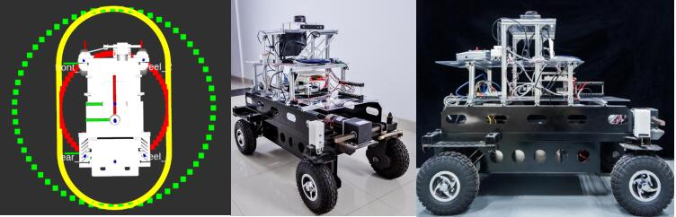
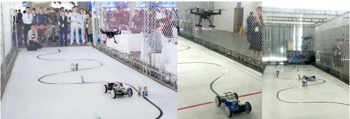
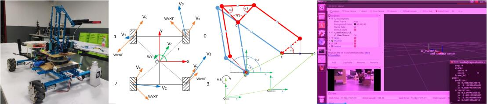
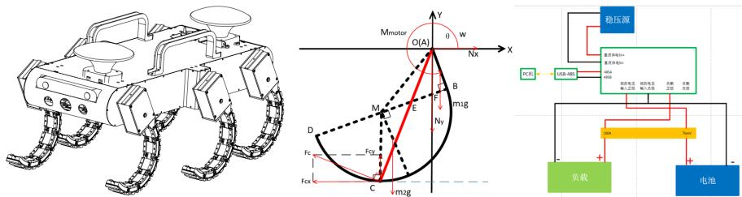
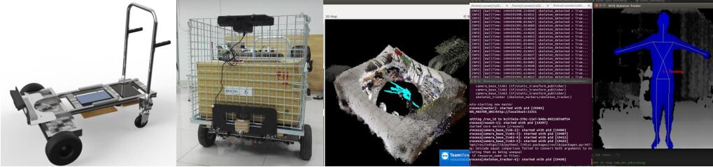
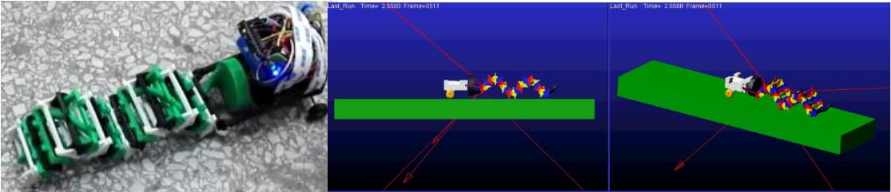
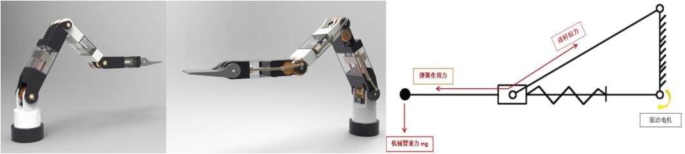
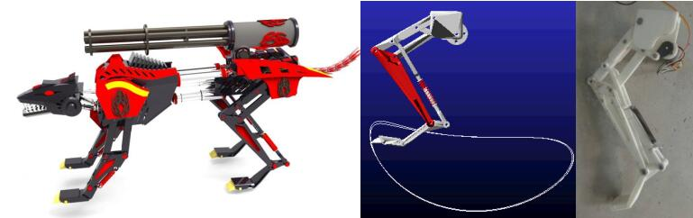
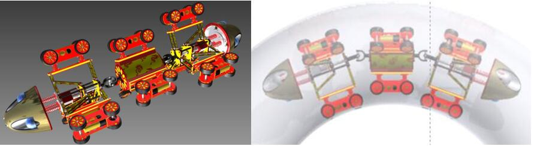

# 个人信息 | Zippen's Info    

* AM: a (mobile) robot designer and maker      
* E-mail: huang_zhipeng@foxmail.com   
* GITHUB: [Zippen-Huang](https://github.com/Zippen-Huang)     

# 研究领域 | Field of Research
 自动驾驶（融合感知与规划、自动控制） | self-driving system(integrated perception and planning,  motion control)    
 仿生与特种机器人 | biologically inspired and specialized robot design and control    

# 成果发表 | Publications

## 论文 | papers
（in preparation）

## 专利 | patents
[1] 一种增力机械手爪. (201620043599.1).    
[2] 一种可实用于内、外管道爬行机器人. (201521050698.4).    
[3] 一种新型机械臂. (201621174783.6).    
[4] 简易玉米脱粒机. (201711319375.4).    
[5] 玉米脱粒机. (201711321004.X).    
[6] 楼宇环境新型文件配送系统. (201910119506.7).     
[7] 基于视觉的二维码定位抓取机器人系统算法. (201910011866.5).    
[8] 一种多分裂高压导线断股修补辅助装置及其使用方法. (201910149941.4).     
[9] 一种应用C形腿的六足机器人动力特性分析方法. (201910300123.X).     
[10]基于SMA驱动方式的新型跳跃机器人. (2019103294229.8).        

**************************************************************************************************************************
# 项目经历 | Robot Projects Development
Robot projects practice, recorded in chronological order.    

## 9 面向室外场景的中型移动机器人系统 | Medium-sized Mobile Robot System for Outdoor Scenes
**简介 | Introduction**  (2017.11 - 2020.06)    
&emsp;&emsp;项目主要研制面向室内外半结构化环境下的中型自主移动机器人软硬件系统，旨在为物流派送、园区巡检、市区清洁等应用场景提供智能移动平台理论和技术支撑。在基于ROS机器人系统平台，集成感知系统、定位系统、规划系统与控制系统，实现给定目标点的情况下，机器人能够在室内外自主导航至目的地。    
&emsp;&emsp;The project develops a medium-sized autonomous mobile robot software and hardware system for indoor and outdoor semi-structured environments, aiming to provide intelligent mobile platform theory and technical support for application scenarios such as logistics dispatch, park inspection and urban cleaning. Based on the ROS(robot operating system) platform, integrated perception system, location system, planning and control system, the robot can navigate to the destination autonomously given the target point.  
   

## 8 基于ROS的“空地协同”机器人系统 | ROS-based "Air-ground Coordination" Robot System     
**简介 | Introduction**  (2019.04 - 2019.05)    
&emsp;&emsp;项目主要为全向移动机器人与无人机之间配合，并沿着设有障碍物的路径行进到终点。无人机通过摄像头识别移动机器人顶部的二维码，以实现跟随运动；移动机器人通过Intel RealSense采集RGB图像，矫正移动机器人的姿态，通过分析深度图，判断前方障碍物的大小与位置，实现避障。    
&emsp;&emsp;The project worked with an omnidirectional mobile robot and a quadrotor, and travels along the path with obstacles to the end. The quadrotor recognizes the QR code on the top of the mobile robot through the camera to achieve the following action; the mobile robot acquires the RGB image through Intel RealSense, corrects the posture of the mobile robot, and analyzes the depth map to determine the size and position of the obstacle in front, thereby avoiding barrier.    
    

## 7 基于二维码定位抓取的自主移动机器人 | Autonomous Mobile Robot Based on QR Code Positioning and Grabbing   
**简介 | Introduction**  (2018.09 - 2018.12)    
&emsp;&emsp;项目主要设计一款搭载四自由度机械臂的全向移动平台，并通过ZED双目摄像头识别附有二维码的物体的空间位姿，完成对目标物的移动、定位与抓取操作。    
&emsp;&emsp;The project designed an omnidirectional mobile platform equipped with a four-degree-of-freedom manipulator, and identifies the spatial pose of the object with the QR code through the ZED stereo camera to complete the moving, positioning and grasping operation of the target.    
    

## 6 六足无人平台动力分析与电源管理 | Dynamic Analysis and Power Management of Hexapod Unmanned Platform    
**简介 | Introduction**  (2017.09 - 2018.04)    
&emsp;&emsp;项目主要研究六足机器人。主要负责机器人动力特性分析，并设计电源管理系统。    
&emsp;&emsp;The project focused on hexapod robots. Mainly responsible for the analysis of robot dynamic characteristics and design of power management system.    
    

## 5 基于手势控制的智能跟随物流车 | Intelligent Follow Logistics Vehicle    
**简介 | Introduction**  (2016.10 - 2017.06)    
&emsp;&emsp;项目主要研究设计兼具手势控制、智能跟随功能的大载重物流车。基于kinect采集人体姿态信息，将之转化为机器人运动控制信息，实现机器人智能跟随。    
&emsp;&emsp;The project designed large-load logistics vehicles with gesture control and intelligent following functions. Based on kinect camera, the human body posture information is collected and converted into robot motion control information to realize robot intelligent following.    
    

## 4 单电机螺旋式驱动机器人 | Single-motor Spiral-driven Robot    
**简介 | Introduction**  (2016.06 - 2016.09)     
&emsp;&emsp;项目主要研制单电机螺旋式驱动的波浪式机器人，通过单电机驱动空间螺旋线机构绕轴线旋转，带动多级串联连杆机构呈“波浪式”运动。    
&emsp;&emsp;The project developed a single-motor spiral-driven wave-type robot, which rotates around the axis by a single-motor-driven space spiral mechanism, and drives the multi-stage series linkage mechanism to be “wave-like”.    
    

## 3 重力自平衡机械臂 | Gravity-balance Robot Arm    
**简介 | Introduction**  (2016.04 - 2016.09)    
&emsp;&emsp;项目主要研究适用于机械臂的负载能力提升装置，采用内嵌式机构平衡机械臂自身重力，并设计应用该辅助装置的小型机械臂。    
&emsp;&emsp;The project studied the load capacity enhancement device applicable to the robot arm, and uses an in-line mechanism to balance the gravity of the arm itself, and a small robot arm to which the auxiliary device is applied.    
    

## 2 仿生四足机器人 | Bionic Quadruped Robot  
**简介 | Introduction**  (2015.08 - 2015.12)    
&emsp;&emsp;项目主要设计一种高速、低惯量、八连杆单自由度仿生腿，以此作为机器人后腿；采用六连杆机构设计机器人前腿，基于此设计仿生腿的仿生四足机器人  
&emsp;&emsp;The project designed a high-speed, low-inertia, eight-link single-degree-of-freedom bionic leg, which is used as the rear leg of the robot. The six-link mechanism is used to design the front leg of the robot. Based on this, the bionic quadruped robot with bionic legs is designed.   
    

## 1 管道检测机器人 | Pipe Inspection Robot     
**简介 | introduction**  (2014.11 - 2015.05)    
&emsp;&emsp;项目主要设计一款能够适用于内管道的可主/被动变形的管道爬行机器人，可通过机构主动调节机器人外围半径，亦可通过弹性元件被动调节机器人外围半径。设计前后对称、总共三（多）节模块化机体，并在机器人前端与后端安装探伤检测仪器，合成运动性能好、扩展性强的管道爬行机器人。    
&emsp;&emsp;The project  designed a pipeline inspection robot that can be applied to the inner pipeline with active/passive deformation. The mechanism can actively adjust the peripheral radius of the robot, and the outer radius of the robot can be passively adjusted by the elastic component. It is symmetrical and modularized, and the detection instrument is installed at the front end and the rear end of the robot to synthesize a pipe crawling robot with good performance and extensibility.    
    
[视频展示 | result show](http://v.youku.com/v_show/id_XMTI3OTE0MTk5Mg==.html)    

**************************************************************************************************************************

# 机器人项目积累 | Accumulation in the Process of Robot Development
记录在项目开发过程中非常有用的资源   
Document useful resources during project development    

## 1 软件 | Software  
### 1.1 开发平台 | Development Platforms
* [ROS](http://wiki.ros.org/)[机器人操作系统]
* [Apollo](http://apollo.auto/)[国内领先开源无人驾驶系统]
* [Autoware](https://github.com/autowarefoundation/autoware) --中文简介:[基于ROS的Most Stars开源代码汇总（自动驾驶汽车+RGBDSLAMv2+ROS2+人识别与跟踪等](http://www.voidcn.com/article/p-srkfvcig-nh.html)
* RVIZ
* Gazabo
* V-REP
* [Stage](https://github.com/rtv/Stage)[移动机器人模拟器]
* player

----------------------------------------------------------------------------------------------------------------------------------
* [Qt](http://qt-project.org/)[跨平台的应用程序和用户界面框架]
* Machine Learning: tensorflow, Caffe, Keras, PyTorch, and so on   

### 1.2 开源库 | the Third-party Libraries
* [Armadillo](http://arma.sourceforge.net/)[高质量的C++线性代数库，速度和易用性做到了很好的平衡,C++下的Matlab替代品]
* [Eigen3](http://eigen.tuxfamily.org/)[高级C++模板头文件库，包括线性代数，矩阵，向量操作，数值解决和其他相关的算法]
* [blaze](https://code.google.com/p/blaze-lib/)[高性能的C++数学库，用于密集和稀疏算法]
* [ceres-solver](http://ceres-solver.org/)[来自谷歌的C++库，用于建模和解决大型复杂非线性最小平方问题]   

----------------------------------------------------------------------------------------------------------------------------------
* OMPL(Open Motion Planning Library)
* [RobWork](http://www.robwork.dk/jrobwork/)[一组C++库的集合，用于机器人系统的仿真和控制]
* [Robotics Library (RL)](http://www.roboticslibrary.org/)[一个独立的C++库，包括机器人动力学，运动规划和控制,偏向工业机器人]
* [MRPT](http://www.mrpt.org/)[移动机器人编程工具包]
* [MOOS-IvP](https://oceanai.mit.edu/moos-ivp/pmwiki/pmwiki.php?n=Main.HomePage)[一组开源C++模块，提供机器人平台的自主权，尤其是自主的海洋车辆]
* [OpenCV](https://github.com/opencv/opencv)[开源计算机视觉库]
* [PCL](http://pointclouds.org/)[点云库是一个独立的，大规模的开放项目，用于2D/3D图像和点云处理]
* [V4R (Vision for Robotics) library](https://rgit.acin.tuwien.ac.at/v4r/v4r_ros_wrappers/blob/master/Tutorial.md)[视觉建模与识别、跟踪，支持ROS]
* [Lightweight Communications and Marshalling (LCM).]( https://lcm-proj.github.io/)[轻量级通信系统，和ROS相似，]
* matlab robotics toolbox    

----------------------------------------------------------------------------------------------------------------------------------
* Boost

### 1.3 其他软件 | Others

## 2硬件 | Hardware  
###  2.1 处理器平台 | Processor Platforms
#### 2.1.1 高级处理器　｜　High-level　Processors
* NVIDIA Jetson Family: TK1, TX1, TX2, NANO, Xaiver
* Intel Family: Intel NUC, Galileo, Edison
* Raspberry Pi Series
* ODROID Series
* 华为机器人开发板  HUAWEI HAISI hikey970

#### 2.1.2 低级处理器　｜　Low-level　Processors
* STM32 Series
* Arduino Series
* openCR

###  2.2 传感器 | Sensors
#### 2.2.1 感知类 ｜Perception
##### 视觉传感器 | Camera
* MicroSoft Kinect
* Intel RealSense
* ZED
* 奥比中光  Astra

##### 激光雷达传感器 | Lidar
* Velodyne
* Sick
* Ibeo
* Hokuyo
* Trimble
* 思岚科技  SLAMTEC
* 速腾聚创
* 禾赛科技
* 北醒光子
* 镭神智能

#### 2.1.2 定位类　｜　Location
* razor-imu-9dof
* Ublox GPS

###  2.1.3 驱动及电机 | Actuators(Motors)
* DYNAMIXEL
* maxon motor

###  2.1.4 机器人平台 | Robot that Integrated Hardware and Software
#### Mobile Robots 
* Turtlebot1, Turtlebot2, Turtlebot3    
* HUSKY   
* RACE CAR   
* Autolabor Pro   

#### Robot Arm  
* Dobot
* uArm
* UR5

#### UAV  
* DJI AUV
* PixHawk

###  2.1.5 其他硬件 | Others

**************************************************************************************************************************

# 经典文献 | Excellent Papers I've Read
## 1.规划与避障 | path planning and collision avoidance algorithms        
**1.0 几何法 | Geometric Modele**          
### 1.1 动态窗 | DWA(Dynamic Window Approach)
* Fox D, Burgard W, Thrun S. The dynamic window approach to collision avoidance[J]. IEEE Robotics & Automation Magazine, 1997, 4(1): 23-33.   
* Brock O, Khatib O. High-speed navigation using the global dynamic window approach[C]//Proceedings 1999 IEEE International Conference on Robotics and Automation (Cat. No. 99CH36288C). IEEE, 1999, 1: 341-346.   

### 1.2 时变橡皮筋算法 | TEB(Timed-Elastic-Band)
* Rösmann C, Hoffmann F, Bertram T. Integrated online trajectory planning and optimization in distinctive topologies[J]. Robotics and Autonomous Systems, 2017, 88: 142-153.   
* Rösmann C, Hoffmann F, Bertram T. Kinodynamic trajectory optimization and control for car-like robots[C]//2017 IEEE/RSJ International Conference on Intelligent Robots and Systems (IROS). IEEE, 2017: 5681-5686.   
* 算法代码：[teb_local_planner](http://wiki.ros.org/teb_local_planner)  

### 1.3 速度避障算法 | VO(Velociety Obstacles)
* Martinez-Gomez L, Fraichard T. Collision avoidance in dynamic environments: an ics-based solution and its comparative evaluation[C]//2009 IEEE International Conference on Robotics and Automation. IEEE, 2009: 100-105.
* Fiorini P, Shiller Z. Motion planning in dynamic environments using velocity obstacles[J]. The International Journal of Robotics Research, 1998, 17(7): 760-772.
* Shiller Z, Large F, Sekhavat S. Motion planning in dynamic environments: Obstacles moving along arbitrary trajectories[C]//Proceedings 2001 ICRA. IEEE International Conference on Robotics and Automation (Cat. No. 01CH37164). IEEE, 2001, 4: 3716-3721.

**3.0 概率法 | Sampling-based Algorithms**        
### 3.1 随机路线图法 | RPM(Random Probabilistic Map)       
* 12345
* 3445

### 3.2 快速扩展随机树 | RRT(Rapidly-exploring Random Tree)   
* 1234
* 3456

--------------------------
https://www.coursera.org/learn/robotics-motion-planning/home/week/3  宾夕法尼亚运动规划   
-----------------------

## 2.控制算法 | control algorithms
### 2.1 模型预测控制器 | MPC(Model Predictive Control)

### 2.2 线性二次型调节器 | LQR(Linear Quadratic Regulator)

### 2.3 滑模控制器 | SMC(sliding mode control)

### 2.4 PID

## 3.感知算法 | perception algorithms
### 3.1 深度学习方向 | Deep Learning
* YOLO
* SSD
* CNN
* DNN
* RNN
* 

## 4.定位算法 | location algorithms

## 5.滤波算法 | Filter algorithms　
### 5.1 卡尔曼滤波 | KF(Kalman Filter)
* EKF(Extend Kalman Filter)
* UKF(Unscented Kalman Filter)

### 5.2 粒子滤波 | PF(Particle Filtering)

## 6.算法缓冲区 | Algorithms Buffer
### 6.1 优化算法分类 | Optimization Methods
* 凸优化 Convex Optimization

* 数值优化 Numerical Optimization

* 图优化 Graph Optimization

**************************************************************************************************************************
# 优秀网站 | Excellent Web I've Seen
Excellent Website Collection

## 1.个人主页 | Personal Main Pages 
* 机械臂和轨迹规划算法相关：[Brian2018](https://blog.csdn.net/libing403/article/details/89344476)    
* NVIDIA JETSON系列开发板及RACE CAR教程网站：[JetsonHacks](https://www.jetsonhacks.com/)
* 机器人算法汇集-超级全：[PythonRobotics by AtsushiSakai](https://github.com/AtsushiSakai/PythonRobotics)
* 机器人大师之路指点迷津：[YY硕](http://www.zhihu.com/people/yyss2037)
* ROS开发实践大神：[古月居](http://www.guyuehome.com/) 和 [R. PATRICK GOEBEL](https://robohub.org/author/patrick-goebel/)
* 树莓派自动小车（Donkey Car）开发经历记录：[SHIROKU](https://shiroku.net/)
* 深度学习相关实践经历：[JK Jung's blog](https://jkjung-avt.github.io/)
* 机器人、游戏开发等计算机相关资料：[Adrian Boeing](http://adrianboeing.blogspot.com/search/label/robotics)
* 做自动驾驶的哥们儿github：[Peter Christiansen](https://github.com/PeteHeine?tab=repositories)
* 罗马的一位机器人大神博客：[The Raffaello's robotics blog](https://rnext.it/)[邮箱：raffaello@rnext.it]
* 详解制作donkeycar过程的团队：[donkeycar project](https://robocaresslingen.github.io/BookDownDocu/index.html#how-to-join-us)和[github](https://github.com/RoboCarEsslingen)
* 自主避障主题:[obstacle-avoidance](https://github.com/topics/obstacle-avoidance)
* 简单路径规划博客：[Andy G's Blog](https://gieseanw.wordpress.com/)
* 自动驾驶、深度学习博客：[阿贵](https://www.zhihu.com/people/a-gui-7/columns)
* 

## 2.综合型网站 | Comprehensive Web
* 机器人软硬件及其编程教程汇集：[创客智造](https://www.ncnynl.com/)   
* 各类软件编程教程网站（程序员的天地):[菜鸟教程 runoob](https://www.runoob.com/)
* 国外数据结构、计算机几何及各类软件编程教程：[GeekforGeeks](https://www.geeksforgeeks.org/)
* 人工智能、机器学习、自动驾驶等技术类综合型资料：[Intro to Artificial Intelligence](https://medium.com/intro-to-artificial-intelligence)
* 慕尼黑工大 凤凰机器人:[TUM Phoenix Robotics](http://www.phoenix.tum.de/index.php?id=5)[无人机与智能移动机器人]
* clearpathrobotics机器人产品化团队:[clearpathrobotics](https://github.com/clearpathrobotics?page=6)
* CMU无人车：[Team Taran Racing from Carnegie Mellon University](http://www.tartanracing.org/)
* 斯坦福无人车：[Stanford Racing from Stanford University](http://cs.stanford.edu/group/roadrunner/)
* 谷歌无人车 Waymo：[Google self-driving car project](https://waymo.com/)
* 英伟达无人驾驶平台：[NVIDIA-DGX-1](http://www.nvidia.com/object/drive-px.html)
* Auro L4自动驾驶：[Auro robotics](http://www.auro.ai/)
* The Autoware Foundation:[link](https://github.com/autowarefoundation)
* Berkeley Autonomous Race Car:[link](http://www.barc-project.com/about-1/)

## 3.资源搜索型网站 | Resource Search Web
* 各类电子书籍下载网站：[Library Genesis](http://gen.lib.rus.ec/)
* 部分论文及其各类电子书下载网址：[arxiv](https://arxiv.org/)[备注：为了防止自己的idea在论文被收录前被别人剽窃，将预稿上传到arvix作为预收录，以证明论文原创性]
* 文献小镇（几乎能下载到所有文献）：[sci-hub](http://www.sci-hub.se/)
* 国外硕博论文下载：[link1](国外硕博论文查询)和[link2](http://www.dart-europe.eu/About/info.php)
* 三维模型下载：[link](https://grabcad.com/library)

**************************************************************************************************************************
# 爱好 | Hobbies
reading and sports

# 感谢 | Thanks
感谢一路上的伙伴们！
